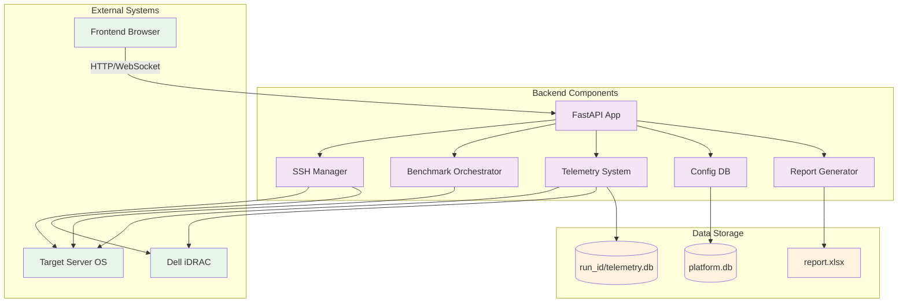

# Backend Architecture

**Author:** Manu Nicholas Jacob  
**Email:** ManuNicholas.Jacob@dell.com  
**Last Updated:** March 4, 2026

## Overview

The backend is built with Python 3.12 and FastAPI, providing a REST API, WebSocket server, and static file serving. It handles all business logic, data persistence, and external system communications.

## Core Components

### FastAPI Application (`app.py`)

The main FastAPI application serves as the central hub for all platform operations:

```python
# Key responsibilities:
- REST API endpoints for configuration, test control, and data access
- WebSocket server for real-time telemetry streaming
- Static file serving for the React frontend
- Request routing and response handling
- Error handling and logging
```

**Major API Categories:**
- **Configuration**: `/api/configs/*` - Server connection profiles
- **Connection**: `/api/connect`, `/api/disconnect` - SSH connection management
- **Testing**: `/api/test/*` - Test execution and monitoring
- **Telemetry**: `/api/telemetry/*` - Real-time and historical data access
- **Reports**: `/api/report/*` - Report generation and download
- **Runs**: `/api/runs/*` - Test run history and management

### SSH Manager (`ssh_manager.py`)

Manages SSH connections to both target OS and iDRAC systems:

```python
class SSHManager:
    # OS Connection (paramiko)
    def __init__(self, os_ip, os_user, os_pass):
        self.os_ssh = paramiko.SSHClient()
        # Handles benchmark execution and OS metrics collection
    
    # iDRAC Connection (SSH → racadm → rootshell)
    def __init__(self, idrac_ip, idrac_user, idrac_pass):
        self.idrac_ssh = paramiko.SSHClient()
        # Handles power/thermal sensor data collection
```

**Connection Flow:**
1. **OS Connection**: Direct SSH to target server
2. **iDRAC Connection**: SSH → `racadm>>` prompt → `rootshell` → `thmtest -g s`

### Benchmark Orchestrator (`benchmarks.py`)

Controls the execution of benchmark workloads on remote servers:

```python
class BenchmarkOrchestrator:
    def __init__(self, ssh_manager, config_db):
        self.ssh_manager = ssh_manager
        self.config_db = config_db
        self.current_phase = None
        self.run_id = None
```

**Key Features:**
- **Phase Management**: Orchestrates 8-phase test sequence
- **Remote Script Deployment**: Uploads and executes `bench_agent.sh`
- **Real-time Monitoring**: Tracks benchmark progress and resource usage
- **Error Handling**: Manages failures and cleanup operations
- **Callback System**: Notifies on phase completion and run completion

### Telemetry System (`telemetry.py`)

Collects and stores performance and power data:

```python
class InboundCollector:
    """Collects OS metrics via SSH every 2 seconds"""
    def collect(self):
        # CPU utilization from /proc/stat
        # Memory usage from free -m
        # Load averages from /proc/loadavg
        # Process information from ps

class OutboundCollector:
    """Collects iDRAC power/thermal data every 5 seconds"""
    def collect(self):
        # Power sensors: SYS_PWR_INPUT_AC, CPU_PWR_ALL, DIMM_PWR_ALL
        # Thermal sensors: inlet, exhaust, CPU temperatures
```

**Data Flow:**
1. **Collection**: Parallel collection threads for OS and iDRAC data
2. **Storage**: Time-series data stored in per-run SQLite database
3. **Streaming**: Real-time data sent via WebSocket to frontend
4. **Aggregation**: Data aggregated for report generation

### Configuration Database (`config_db.py`)

Persistent storage for platform configuration and run metadata:

```python
class ConfigDB:
    """SQLite database for platform-wide configuration"""
    # Tables:
    # - configs: Server connection profiles
    # - sanity_results: System information and tool availability
    # - runs: Test run metadata and status
    # - run_summaries: Aggregated run results
```

**Database Schema:**
```sql
CREATE TABLE configs (
    id INTEGER PRIMARY KEY,
    name TEXT NOT NULL,
    os_ip TEXT NOT NULL,
    os_user TEXT NOT NULL,
    os_pass TEXT NOT NULL,
    idrac_ip TEXT NOT NULL,
    idrac_user TEXT NOT NULL,
    idrac_pass TEXT NOT NULL,
    notes TEXT,
    created_at TIMESTAMP,
    updated_at TIMESTAMP
);

CREATE TABLE runs (
    id TEXT PRIMARY KEY,  # UUID
    config_id INTEGER,
    start_time TIMESTAMP,
    end_time TIMESTAMP,
    status TEXT,  # running, completed, failed, stopped
    current_phase TEXT,
    summary_json TEXT,
    FOREIGN KEY (config_id) REFERENCES configs(id)
);
```

### Report Generator (`reports.py`)

Creates comprehensive Excel reports with charts and analysis:

```python
class ReportGenerator:
    def generate_report(self, run_id):
        # Creates 7-sheet Excel workbook:
        # 1. Summary - System info, per-phase stats, overall metrics
        # 2. OS Metrics - Raw time-series data
        # 3. Power Metrics - Raw power/thermal time-series
        # 4. Phase Summary - Aggregated per-phase performance
        # 5. System Info - Complete system information
        # 6. Benchmark Events - Phase start/end events
        # 7. Charts - Embedded charts for trends
```

**Report Features:**
- **Multi-sheet Workbook**: Organized data presentation
- **Embedded Charts**: Visual trend analysis
- **Statistical Analysis**: Per-phase and overall metrics
- **Data Exports**: CSV files for raw data access
- **Professional Formatting**: Corporate-ready presentation

## Data Flow Architecture



## Request Processing Flow

### 1. Configuration Management
```python
# User saves server configuration
POST /api/configs
{
    "name": "Test Server",
    "os_ip": "192.168.1.100",
    "os_user": "dell",
    "os_pass": "calvin",
    "idrac_ip": "192.168.1.101",
    "idrac_user": "root",
    "idrac_pass": "calvin"
}
```

### 2. Connection Establishment
```python
# User connects to server
POST /api/connect
{
    "config_id": 5
}

# Backend:
# 1. Load config from database
# 2. Establish SSH connections to OS and iDRAC
# 3. Run sanity check
# 4. Store connection state
```

### 3. Test Execution
```python
# User starts test
POST /api/test/start
{
    "config_id": 5,
    "phase_duration": 30,
    "rest_duration": 10
}

# Backend:
# 1. Generate run_id (UUID)
# 2. Create per-run telemetry database
# 3. Start telemetry collection threads
# 4. Execute benchmark phases sequentially
# 5. Stream real-time data via WebSocket
# 6. Store results and generate summary
```

### 4. Real-time Data Streaming
```python
# WebSocket connection
ws://localhost:8001/ws

# Data format:
{
    "type": "telemetry",
    "timestamp": "2026-03-04T11:00:00Z",
    "data": {
        "cpu_utilization": 85.2,
        "memory_usage": 45.1,
        "power_input": 350.5,
        "cpu_power": 125.3,
        "current_phase": "02_hpl_100pct"
    }
}
```

## Error Handling and Resilience

### Connection Management
- **Automatic Reconnection**: SSH connections automatically reconnect on failure
- **Connection Pooling**: Reuse connections for multiple operations
- **Timeout Management**: Configurable timeouts for all operations
- **Graceful Degradation**: Continue operation when optional components fail

### Data Integrity
- **Transaction Management**: Database operations use transactions
- **Data Validation**: Input validation for all API endpoints
- **Backup and Recovery**: Automatic backup of critical data
- **Consistency Checks**: Verify data integrity across operations

### Performance Optimization
- **Async Operations**: Non-blocking I/O for concurrent operations
- **Connection Caching**: Reuse SSH connections and database connections
- **Memory Management**: Efficient data structures and cleanup
- **Rate Limiting**: Prevent resource exhaustion

## Security Considerations

### Credential Management
- **Encryption**: All credentials encrypted at rest
- **Secure Transmission**: SSH connections use encrypted channels
- **Access Control**: Role-based access to sensitive operations
- **Audit Logging**: All operations logged for security auditing

### Network Security
- **Firewall Configuration**: Only necessary ports exposed
- **SSL/TLS Support**: HTTPS support for production deployments
- **Input Validation**: Comprehensive input sanitization
- **Rate Limiting**: Prevent brute force attacks

## Technology Stack

| Component | Technology | Version | Purpose |
|-----------|------------|---------|---------|
| **Web Framework** | FastAPI | 0.115.0 | REST API and WebSocket server |
| **HTTP Server** | Uvicorn | 0.30.0 | ASGI server |
| **SSH Library** | Paramiko | 3.4.0 | SSH connections and SFTP |
| **Database** | SQLite | 3.41+ | Configuration and telemetry storage |
| **Excel Generation** | OpenPyXL | 3.1.5 | Report generation |
| **WebSocket** | Websockets | 12.0 | Real-time communication |
| **Async Framework** | AsyncIO | Built-in | Concurrent operations |

## Development Guidelines

### Code Organization
- **Modular Design**: Each component has single responsibility
- **Interface Segregation**: Clean interfaces between components
- **Dependency Injection**: Components receive dependencies via constructor
- **Configuration Management**: Externalized configuration

### Testing Strategy
- **Unit Tests**: Test individual components in isolation
- **Integration Tests**: Test component interactions
- **End-to-End Tests**: Test complete workflows
- **Mock Services**: Mock external dependencies for testing

### Performance Monitoring
- **Logging**: Comprehensive logging for debugging and monitoring
- **Metrics**: Performance metrics collection and reporting
- **Health Checks**: Component health verification
- **Profiling**: Performance profiling for optimization
