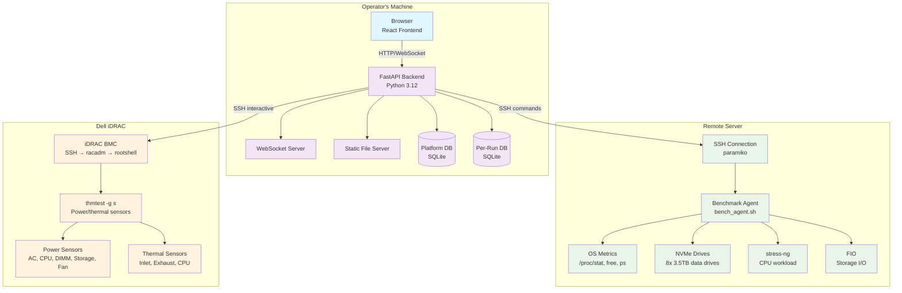
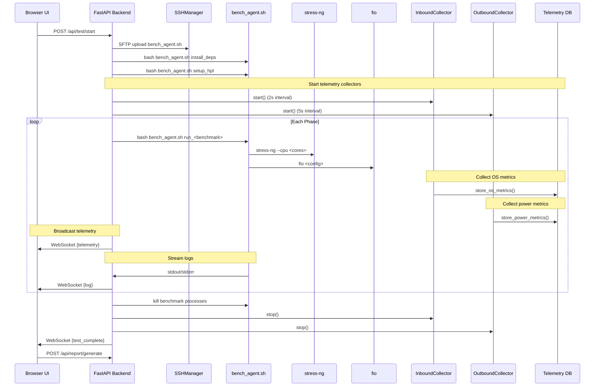
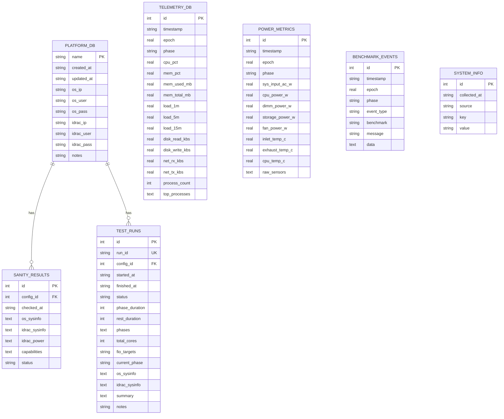
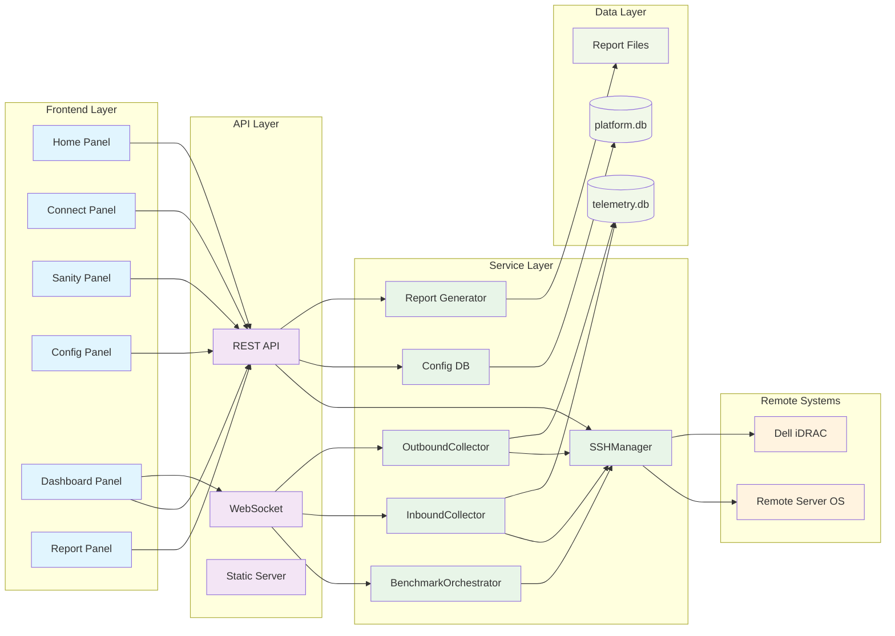

# System Architecture Diagrams

**Author:** Manu Nicholas Jacob  
**Email:** ManuNicholas.Jacob@dell.com  
**Last Updated:** March 4, 2026

## High-Level System Overview



## Data Flow Architecture

```mermaid
flowchart TD
    subgraph "Telemetry Collection"
        IN[InboundCollector<br/>2s interval]
        OUT[OutboundCollector<br/>5s interval]
        STORE[(Telemetry DB<br/>per-run)]
        BROADCAST[WebSocket<br/>2s broadcast]
    end
    
    subgraph "OS Metrics Sources"
        PROC[/proc/stat]
        FREE[free -m]
        LOAD[/proc/loadavg]
        PS[ps command]
    end
    
    subgraph "iDRAC Power Sources"
        THMTEST[thmtest -g s]
        AC[SYS_PWR_INPUT_AC]
        CPU[CPU_PWR_ALL]
        DIMM[DIMM_PWR_ALL]
        STORAGE[STORAGE_PWR]
        FAN[FAN_PWR_MAIN]
        THERMAL[Thermal sensors]
    end
    
    PROC --> IN
    FREE --> IN
    LOAD --> IN
    PS --> IN
    
    THMTEST --> OUT
    AC --> OUT
    CPU --> OUT
    DIMM --> OUT
    STORAGE --> OUT
    FAN --> OUT
    THERMAL --> OUT
    
    IN --> STORE
    OUT --> STORE
    IN --> BROADCAST
    OUT --> BROADCAST
    
    classDef collector fill:#e3f2fd
    classDef source fill:#e8f5e8
    classDef storage fill:#f1f8e9
    classDef ws fill:#fff8e1
    
    class IN,OUT collector
    class PROC,FREE,LOAD,PS,THMTEST,AC,CPU,DIMM,STORAGE,FAN,THERMAL source
    class STORE storage
    class BROADCAST ws
```

## Benchmark Execution Flow



## Database Schema Overview



## Component Interaction Map


